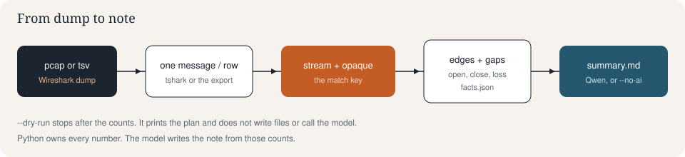
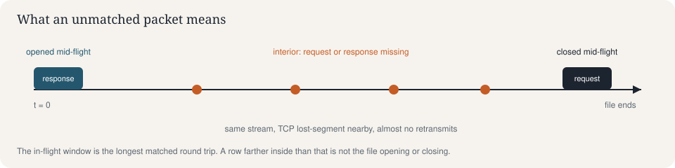
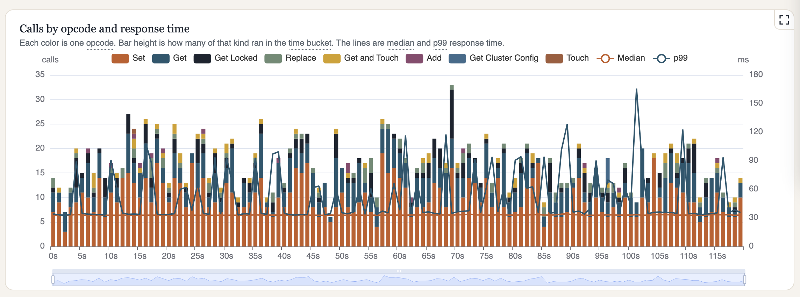
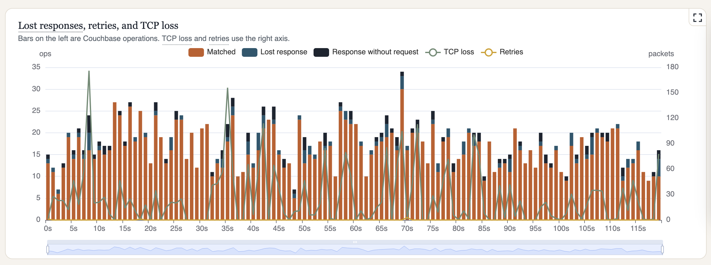
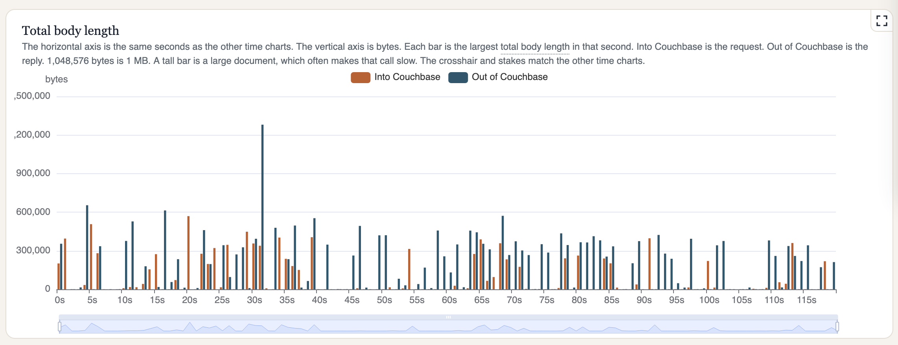

# Couchbase Wireshark analyzer

## Problem

A Wireshark dump of Couchbase is a long list of requests, replies, opcodes, document sizes, and TCP holes. One slow operation is one row in that list. The useful question is the larger picture: what else was happening in that same second, and what keeps happening across the capture.

- Did response time rise with one command, or with everything?
- Did missing replies sit next to TCP holes, or on their own?
- Did a large document move in or out in the same second as the slow calls?
- Is the pattern one connection, or the whole client?

The dump has the packets. It does not line those trends up.

## Solution

One run writes two things, side by side in the output folder.

**The note, `summary.md`.** A model writes this from the counts: what the capture did, the slow tail, the missing replies, and the next questions. The default is local Ollama with Qwen. The same brief can go to an OpenAI-compatible API instead. `--no-ai` skips the model and writes the counted note. A model run also keeps that counted text as `summary.computed.md`.

**The chart page, `charts.json` and `index.html`.** `charts.json` is the analysis: one-, five-, and ten-second buckets, percentiles, opcodes, body size, TCP loss, client connections, and the points of interest. `index.html` draws that file. The heading names the Couchbase server. A bar under the title jumps to Timings, Operations, Packets, Clients, Documents, Marks, Report, and Glossary. The section pills stay on the left. On the right of that same bar, plain links open `summary.md`, `summary.computed.md` when that file is present, and `charts.json`. **summary.md** opens `summary.html`, which formats the note in the same colors and type as the chart page. Chips under each heading jump to that chart, and a dotted word jumps to its glossary entry. The time charts share a crosshair. A stake marks the same second on every chart, so opcode mix, response time, missing replies, TCP loss, and body size can be read together. Packets on port 11210 are bars by command, request, and response. A copy icon next to a document id or an opaque puts the Wireshark filter on the clipboard. Open the folder with a local web server. A `file://` page cannot read `charts.json`. The previous single-column page is `index.original.html`.

Python owns every number in both. The model does not invent the counts. Only packets from or to TCP port 11210 are counted. That is `tcp.port == 11210`, both directions. A capture limited to `dst port 11210` has the requests and not the replies.





The match key is `tcp.stream` plus `couchbase.opaque`. Opaque is the client’s semi-transaction number: the request and its reply carry the same value, and the same opaque on another stream is a different call. Common display filters for a document, one opaque, an opcode, a status, a large body, and TCP loss are in [CB_WIRESHARK.md](CB_WIRESHARK.md). The in-flight window is the longest matched round trip: a response at the open of the file, and a request at the close, are the capture cutting through calls already on the wire. Unmatched rows farther inside the file are counted with the TCP gaps when a pcap is available.

### Calls by opcode and response time



Each color is one Couchbase command. Bar height is how many of that command ran in the second. Median and p99 are the lines on the millisecond axis. Read it for the correlation: a p99 spike next to a tall stack is one command getting slow, or a mix of commands getting slow together.

### Lost responses, retries, and TCP loss



The bars are Couchbase operations: matched calls, requests whose reply is missing, and replies whose request is missing. Dashed lines split TCP loss by direction. Loss toward the client is a hole in the reply path. Loss toward the server is a hole in the request path. A lost response beside loss toward the client means the reply was probably never in the recording.

### Total body length



Bars are the largest Couchbase body in that second, one document in and one document out. Dashed lines add every document byte in that second. A high bar is one large document. A high line is a busy second. A 1 Gbit NIC can carry about 125 MB/s (125,000,000 bytes). A 10 Gbit NIC can carry about 1,250 MB/s (1,250,000,000 bytes). The points-of-interest table puts median, p99, the top opcode, those byte totals, and both loss directions on the same second.

## Getting Started

You need Python 3.11 or newer and tshark (from Wireshark). The chart page does not need a network. The model note needs either Ollama on this machine, or an OpenAI-compatible API you can reach from it.

```bash
git clone https://github.com/Fujio-Turner/cb_wireshark_analyzer.git
cd cb_wireshark_analyzer
python3 -m venv .venv
source .venv/bin/activate
pip install -r requirements.txt

python3 analyze_capture.py --no-ai /path/to/capture.pcap -o ./orphan-report
cd orphan-report
python3 -m http.server
```

Open `http://127.0.0.1:8000/`. Drop `--no-ai` to add the note. With the default config that calls Ollama. To send the same brief to your own API, set `ai.provider` to `openai` as shown below. The virtual-machine section and the Docker section have the full install steps. To record a capture on the Couchbase node, follow [CB_TCPDUMP.md](CB_TCPDUMP.md). To jump from a slow row back to Wireshark, use the stream and opaque with the filters in [CB_WIRESHARK.md](CB_WIRESHARK.md).

## Config

`config.json` in the project root:

```json
{
  "ollama": {
    "base_url": "http://127.0.0.1:11434",
    "model": "qwen3.8:27b-mlx",
    "timeout_seconds": 600
  },
  "tshark": "",
  "output_dir": ""
}
```

An empty `tshark` or `output_dir` means "detect it" and "write `orphan-report/` next to the input". A flag on the command line wins over the environment, which wins over this file. `OLLAMA_BASE_URL` and `TSHARK` are the environment names. `qwen3.8-notes:latest` is the other local tag if you want it in `model`.

The default model is Ollama on this machine. To send the counted brief to an API off the laptop, add an `ai` object. The service must accept `POST {base_url}/chat/completions` in the OpenAI chat shape. OpenAI, OpenRouter, and a company gateway that speaks that API all fit. Python still produces every number. The API only writes the note.

```json
{
  "ai": {
    "provider": "openai",
    "base_url": "https://api.openai.com/v1",
    "model": "gpt-4.1-mini",
    "timeout_seconds": 600
  }
}
```

Put the key in the environment, not in `config.json`:

```bash
export AI_API_KEY="your key"
python3 analyze_capture.py /path/to/capture.pcap -o ./orphan-report
```

`OPENAI_API_KEY` is accepted as well. `AI_PROVIDER`, `AI_BASE_URL`, and `AI_MODEL` override the file. The same switch on the command line is `--provider openai --api-base https://api.openai.com/v1 --model gpt-4.1-mini`. A local OpenAI-compatible server on `localhost` can omit the key. Any other host needs one.

## Run on a virtual machine

These steps are for an Ubuntu VM (or any Linux host) with the repo checked out. The same virtualenv commands work on macOS. tshark comes from Wireshark; on a Mac with the app installed, the script finds it under `/Applications/Wireshark.app` when it is not on `PATH`.

```bash
sudo apt-get update
sudo apt-get install -y python3 python3-venv tshark
# Offline pcaps do not need dumpcap setuid. Answer "no" if the package asks.

git clone https://github.com/Fujio-Turner/cb_wireshark_analyzer.git
cd cb_wireshark_analyzer
python3 -m venv .venv
source .venv/bin/activate
pip install -r requirements.txt

# See the plan. Nothing is written and Ollama is not called.
python3 analyze_capture.py --dry-run /path/to/capture.pcap

# Counted note only.
python3 analyze_capture.py --no-ai /path/to/capture.pcap -o ./orphan-report

# Counted note plus the local model. Ollama must already be listening.
python3 analyze_capture.py /path/to/capture.pcap -o ./orphan-report

python3 -m pytest -q
```

Install Ollama on the VM if the note should be written there, or point `ollama.base_url` at a machine that already has `qwen3.8:27b-mlx`. To use an API instead, set `ai.provider` to `openai` and export `AI_API_KEY`. `--dry-run` and `--no-ai` do not need the model.

A `.tsv` or `.csv` field export works too. Request rows are 10 columns (frame, time, tcp.stream, source, source port, destination, destination port, opcode, opaque, key). Response rows are 6 (frame, time, tcp.stream, opcode, opaque, status). A header row that names those fields also works. When a pcap sits next to `reqs.tsv`, the pcap is used, because that export leaves `couchbase.key` empty on collections and can join several messages into one row. `--from-tsv` keeps the spreadsheet files.

```bash
python3 analyze_capture.py reqs.tsv --resps resps.tsv --from-tsv --dry-run
```

## Run in Docker

`docker-compose.yml` builds one image and exposes two services: `analyze` and `test`. The image includes Python, pytest, and tshark. Ollama is not in the image. Compose points the container at `host.docker.internal` so it can use the model on the machine running Docker.

Put a capture in `captures/` (that directory is gitignored except for the placeholder).

```bash
docker compose build

# Unit tests. No capture and no model.
docker compose run --rm test

# Plan only. No files written, model not called.
docker compose run --rm analyze --dry-run --no-ai /captures/your.pcap -o /out

# Counted note, written to ./orphan-report on the host.
docker compose run --rm analyze --no-ai /captures/your.pcap -o /out

# Counted note plus Qwen on the host.
docker compose run --rm analyze /captures/your.pcap -o /out
```

`CAPTURE_DIR` and `OUT_DIR` change the mounts. `OLLAMA_BASE_URL` changes where the container sends a local Ollama request. `AI_PROVIDER`, `AI_BASE_URL`, `AI_MODEL`, and `AI_API_KEY` send the note to an OpenAI-compatible API instead. From a Linux VM, `host.docker.internal` is added by Compose (`host-gateway`). Start Ollama on the host before the last command when you are not using that API.

## Charts

Every run writes `charts.json` and `index.html` next to the note. The page is grouped. **Timings** opens with latency tiles: median, p90, p95, p99, max, and how many matched calls were at least 100 ms or 250 ms. **Operations** is opcode mix and p99. **Packets** is the port-11210 bars, lost responses, and the missing-call tabs. **Clients** is the fleet and one address. The pie is the eight clients with the most missing replies, then one slice for every other client. The bar counts clients in six unanswered-percent bands, so it stays the same size for thousands of clients. One address and its connections are below that. **Documents** is body length and the ten-id tables. **Marks** is the points of interest. **Report / Questions** opens the formatted note and lists the next questions. **Glossary** follows. On a wide window, related charts sit side by side. A side panel switches the time bucket (1, 5, or 10 seconds) and switches every numeric axis between linear and log. The time charts share one crosshair. Double-click drops a stake on that second. The stake stays when a legend series is hidden. Each chart has an expand control that opens it on a black transparent overlay and keeps the current zoom and stakes.

The ten slowest matched calls are listed with the response time, the second the request was sent, and the body size. **Set Stake** marks that second on the other charts, which is how a single slow call is placed back into the trend. Requests with no response, and responses with no request, each show up to ten rows spaced across the capture rather than the first ten. The tab label is the full count. Every unanswered request is in `orphans.tsv`. **Next questions / steps** is written from the same counts as the note.

The same page also has the latency histogram, round-trip percentiles, a chart of median and p99 with dashed TCP-loss and retry lines, a min-to-max candle, and p99 by opcode. Client addresses are in **Clients**.

From the report folder:

```bash
python3 -m http.server
```

Then open `http://127.0.0.1:8000/`. A browser that opens the file directly will not be allowed to read `charts.json`. ECharts is stored in `web/vendor/` and copied next to the page, so the charts do not need a network.

## Dry run

`--dry-run` still reads the capture and counts. It prints the output directory, the files it would write, whether it would call the model, and the three headline counts. It does not create the directory and it does not call Ollama.

```bash
python3 analyze_capture.py --dry-run /path/to/capture.pcap
```

## Output

| File | What it is |
|---|---|
| `summary.md` | The note. The model writes it unless `--no-ai` is set. `summary.html` renders it. |
| `summary.computed.md` | The counted note. Written on a model run, next to the model text. The report page shows it when the file is there. |
| `summary.html` | The note, formatted with the same header and colors as the chart page. |
| `facts.json` | The counts the note is built from. |
| `charts.json` | One-, five-, and ten-second aggregates for the chart page. |
| `index.html` | ECharts page, grouped with a section bar. Open it from a local server so it can read `charts.json`. |
| `index.original.html` | The previous single-column chart page. |
| `orphans.tsv` | Unanswered requests, one per row, with the document key. |
| `reqs.pdus.tsv` | One client request per row. Column J is the logical key. |
| `resps.tsv` | One client response per row. |

## Tests

```bash
source .venv/bin/activate
python3 -m pytest -q
```

`python3 analyze_capture.py --self-test` runs that same suite. In Docker, `docker compose run --rm test` runs it inside the image. The tests use small fixtures. They do not read a pcap and they do not call Ollama.

## Wireshark filters

[CB_TCPDUMP.md](CB_TCPDUMP.md) is how to record the pcap on the Couchbase node. [CB_WIRESHARK.md](CB_WIRESHARK.md) lists the display filters for a document id, one request and its reply, opcodes, status, large bodies, and TCP loss on port 11210. It walks through tracing a request that never got a response, including the false positives at the end of the file. It also explains `couchbase && tcp.time_delta > 0.05`, how to add that gap as a column, and why a durability level that waits for disk slows the reply.

## Release Notes

[RELEASE_NOTES.md](RELEASE_NOTES.md)

## Troubleshooting

**tshark is not found.** On macOS, install Wireshark. The script looks on `PATH`, then in `/Applications/Wireshark.app`. Set `tshark` in `config.json` or `TSHARK` if the binary lives somewhere else.

**The chart page is blank, or it says it could not read `charts.json`.** Open the report through a local server (`python3 -m http.server` in the report folder). A browser will not let a `file://` page read `charts.json`.

**The model note was not written.** For the default, Ollama has to be listening at `ollama.base_url`, and the `model` tag has to be pulled. For `--provider openai`, the base URL has to answer `/chat/completions`, and `AI_API_KEY` or `OPENAI_API_KEY` has to be set when the host is not local. `--no-ai` skips the model and still writes the counted `summary.md`. If the model call fails, that counted note is what gets saved.

**Docker cannot reach the model.** Ollama stays on the host. Compose uses `host.docker.internal`. Start Ollama on the host before `docker compose run analyze` without `--no-ai`. For a remote API, pass `AI_PROVIDER`, `AI_BASE_URL`, `AI_MODEL`, and `AI_API_KEY` into the `analyze` service.

**A `.tsv` next to a pcap was ignored.** When both are in the folder, the pcap is used. `--from-tsv` keeps the spreadsheet files. Collection document ids are `couchbase.key.logical_key`. An export of `couchbase.key` is often empty.

**One client sent every request.** **Clients** says so, and the bar and pie split that address by connection.

**Find that call in Wireshark.** The slow-call table has the TCP stream and the opaque. [CB_WIRESHARK.md](CB_WIRESHARK.md) has the filter, plus filters for a document id such as `couchbase.key.logical_key == "invoice:12345"`.

## License

[Apache License 2.0](LICENSE)
